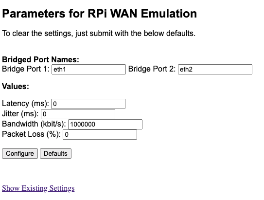

# TCGUI (Linux Traffic Control Front-End)
Put a device (typically a Raspberry Pi) inline of your WAN connections, to be used to artifically increase/decrease
Latency, Loss, Jitter, or Bandwidth using a web form. 

Original idea taken from: http://www.uebi.net/howtos/rpiwanem.htm but this now ports it to an easy executable to be run
from any device without a need for any manual configurations.
  
###  Supported Operating Sytems:
- Linux  

As tcgui utilizes the linux command '[tc](https://man7.org/linux/man-pages/man8/tc.8.html)', only Linux is supported

## Install
For any linux based system just run the command below to install the latest version:
```bash
bash -c "$(curl -sL https://raw.githubusercontent.com/nopg/tcgui/main/get.sh)"
```

## Usage
- Just run `./tcgui` and the pc/rpi will now be running a webserver, defaults to port 8888 but can be changed:
- Run `./tcgui -p 80` to use port 80 (likely requires sudo)

### Screenshot/Example:


## Topology
You should have a device with 3 separate NIC's. Choose one for your 'out of band' management. The remaining 2 ports 
will be used to 'bridge' the connection between your WAN and Router:  

                            eth0 (mgmt)  
                              |  
          WAN   <-->  eth1 :YOUR DEVICE: eth2  <-->   Router

Example /etc/network/interfaces config:
```
auto lo
 iface lo inet loopback

auto eth0
 iface eth0 inet static
 address 10.10.10.200/24   # Out of Band Management/Device IP
 gateway 10.10.10.1

auto br0
iface br0 inet static
 bridge_ports eth1 eth2
 bridge_stp off
 address 192.168.250.250/24 # Dummy/fake IP to keep tc happy
 gateway 192.168.250.1      # Dummy/fake IP to keep tc happy
 ```
